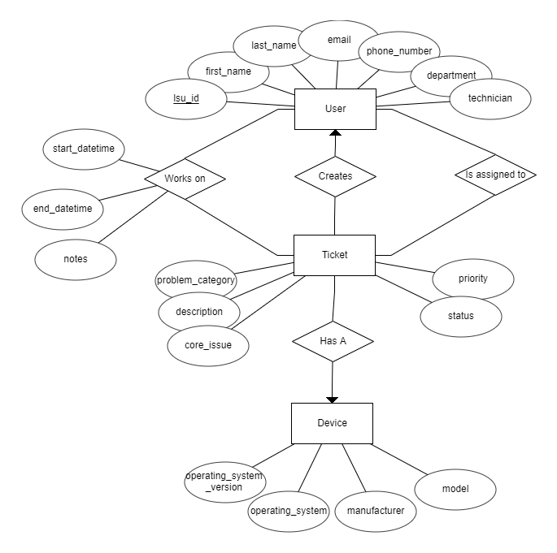
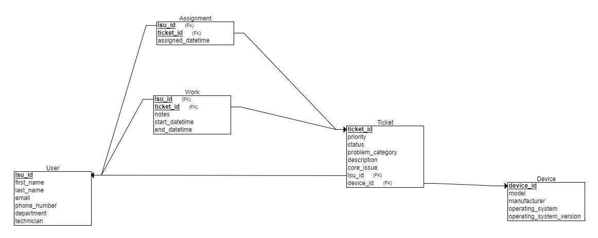
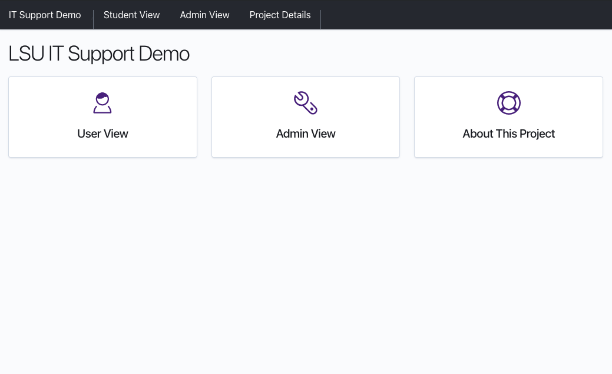
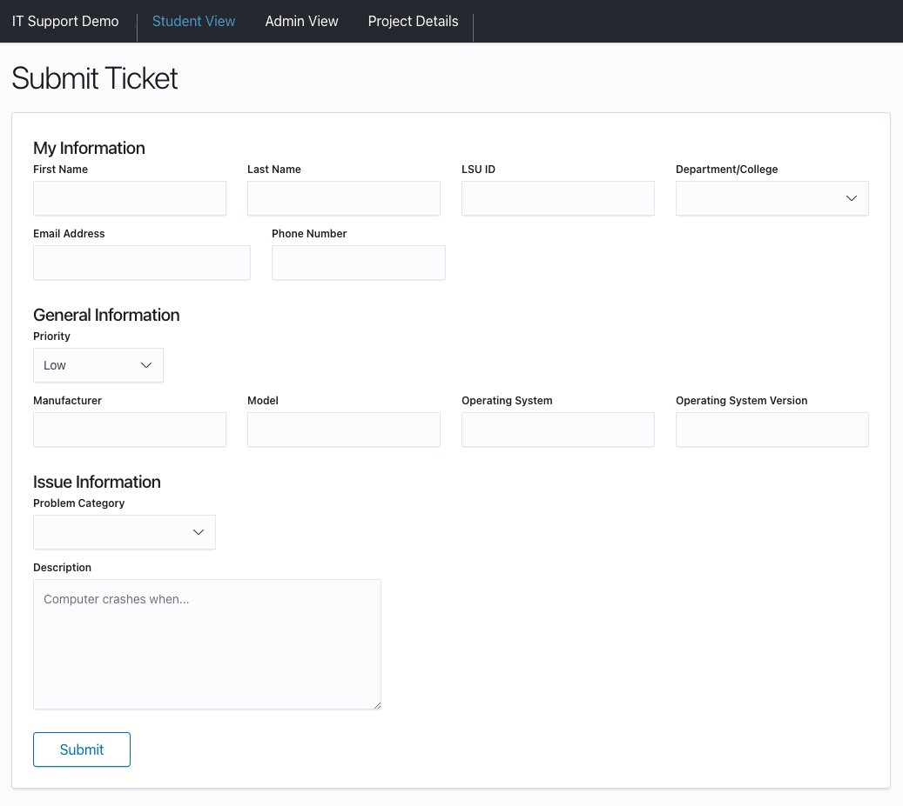
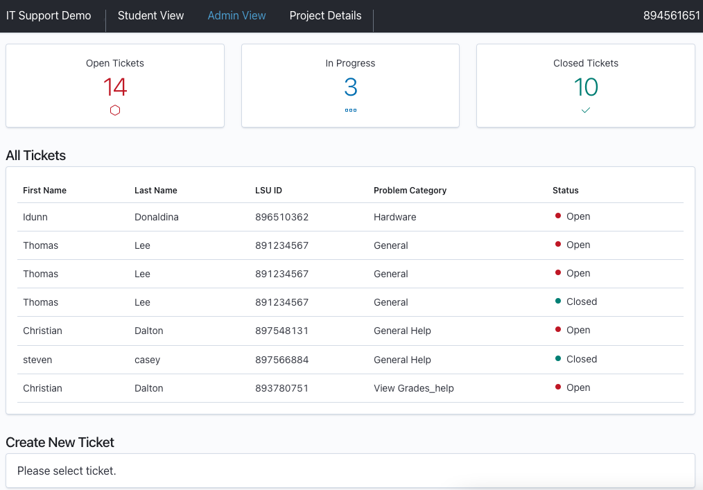
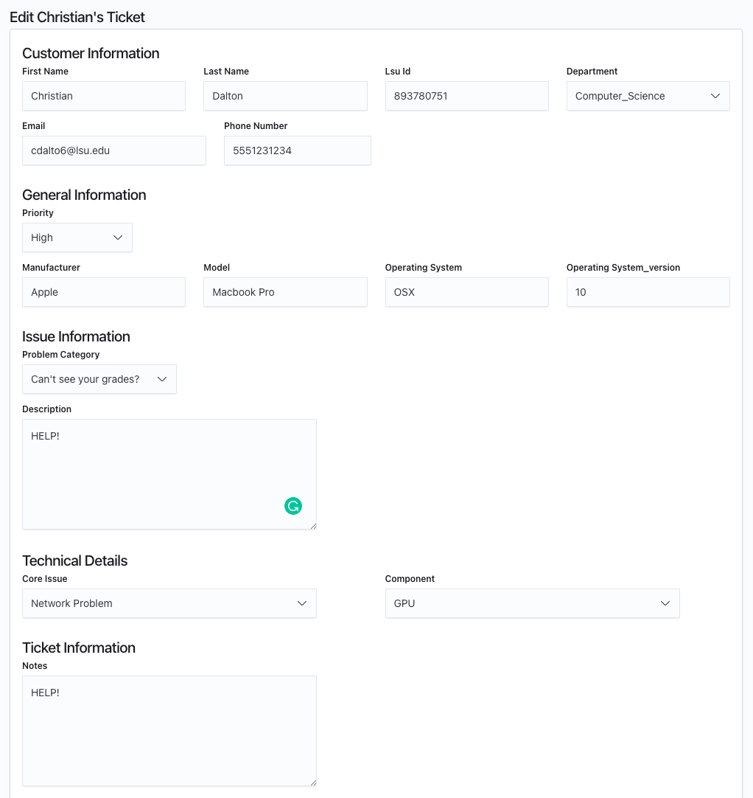
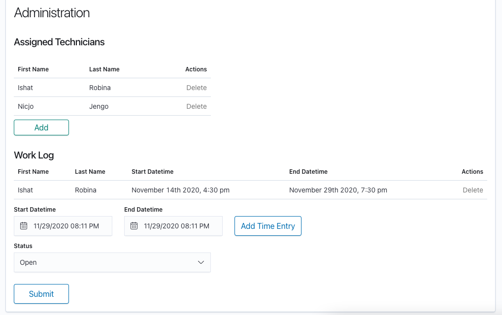

# IT Support Ticketing App

The IT Support Ticketing Web Application is a web application primarily oriented around a user who can be a technician or a customer. The user can make tickets capable of effectively reporting IT support issue and update the user on the status of the problem. The app and corresponding database also assign issues the user is facing to technicians to handle the problem.

Live Demo: https://lsu-it-support-demo.herokuapp.com/

# Domain

## Analysis

The users can create tickets which update tables; one related to the ticket itself, one related to the device with which the user is having. If the user is a technician, they will also have access to additional two tables which track technician-ticket assignments and technician-work logs respectively.




## Constraints

- Users must have an LSU ID, first name, last name, email, and must identify themselves as either technician or standard user.
- Tickets must have an issuer (foreign key to lsu_id), a priority, status, and problem category.

## Assumptions

- Users have devices that have problems.
- The tickets could have multiple technicians working on them.
- The user has information on their device.
- The user only has one device with a problem with each ticket.

# Snapshots



## User View



## Admin View



### Creation of Technicians


### Assignment of Technicians


### Updating Ticket




# Scripts

## Production

Heroku scripts used automatically for deployment:

- yarn start
- yarn build
- yarn build:client
- yarn build:api

## Development

```
yarn run dev
```

```
npm run dev
```

Runs client @ http://localhost:3000 and sever @ http://localhost:5000 concurrently from root directory.
